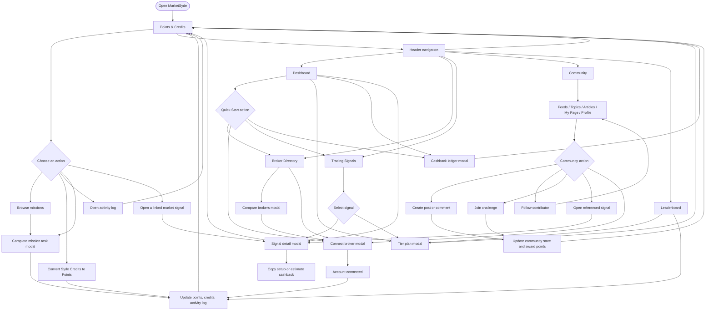

# MarketSyde

MarketSyde is a trader rewards dashboard combining broker rebates, market signals, community features, and points-based progression.

## UX Flow



## Primary Views

- **Points & Credits:** missions, credit conversion, activity history, and reward progression.
- **Dashboard:** quick-start onboarding, performance, broker highlights, signals, and cashback access.
- **Broker Directory:** filter partners, compare rebate conditions, and connect a trading account.
- **Trading Signals:** filter and inspect market setups, with tier-gated upgrade prompts.
- **Community:** browse feeds, topics, articles, profiles, challenges, and trader discussions.
- **Leaderboard:** view rankings and earn additional points.

## Development

```bash
npm install
npm run dev
```